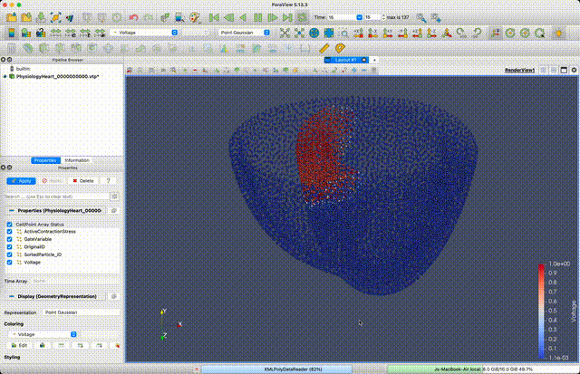

# How to run simulation
# ------------------------------
Open terminal in folder /electromechanical-heart-simulator  
mkdir build && cd build  
cmake .. -DCMAKE_BUILD_TYPE=Release  
(NOTE: if no -DCMAKE_BUILD_TYPE=Release at the end, the compiled code runs much slower because it will be in debug mode)  

At top of /sim/excitation-contraction.cpp, set int particle_relaxation_flag = 1;  
make -j$(nproc)  

Then open terminal in folder /electromechanical-heart-simulator/build/sim/bin/  
./sim  

At top of /sim/excitation-contraction.cpp, set int particle_relaxation_flag = 0;  
Open terminal in the /electromechanical-heart-simulator/build folder  
make -j$(nproc)  

Then open terminal in folder /electromechanical-heart-simulator/build/sim/bin/  
./sim  

Use software ParaView (https://www.paraview.org/) to view the simulation result  
Results will be in folder /electromechanical-heart-simulator/build/sim/bin/output  
Install ParaView: brew install paraview  
ParaView can open MechanicalHeart_0000000000.vtp and play the simulation movie  

# Install dependencies
# ------------------------------
## Manjaro Linux
sudo pacman -Syu  
sudo pacman -S base-devel cmake git python python-pip eigen  
sudo pacman -S cmake git gcc-fortran  
sudo pacman -S tbb  

Install Simbody:  
cd Desktop  
git clone https://github.com/simbody/simbody.git  
cd simbody  
mkdir build && cd build  
cmake .. -DCMAKE_BUILD_TYPE=Release  
make -j$(nproc)  
sudo make install  
export CMAKE_PREFIX_PATH=/usr/local  

## MacOS
brew install eigen  
brew install tbb  
brew install boost  
brew install googletest  

Install somebody:  
git clone https://github.com/simbody/simbody.git  
cd simbody  
mkdir build && cd build  
cmake .. -DCMAKE_BUILD_TYPE=Release  
make -j$(nproc)  
sudo make install  
Now can delete the simbody folder  
